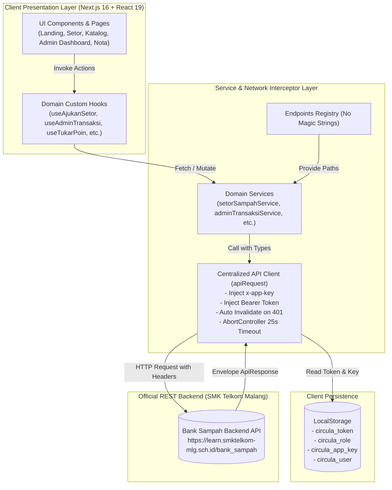
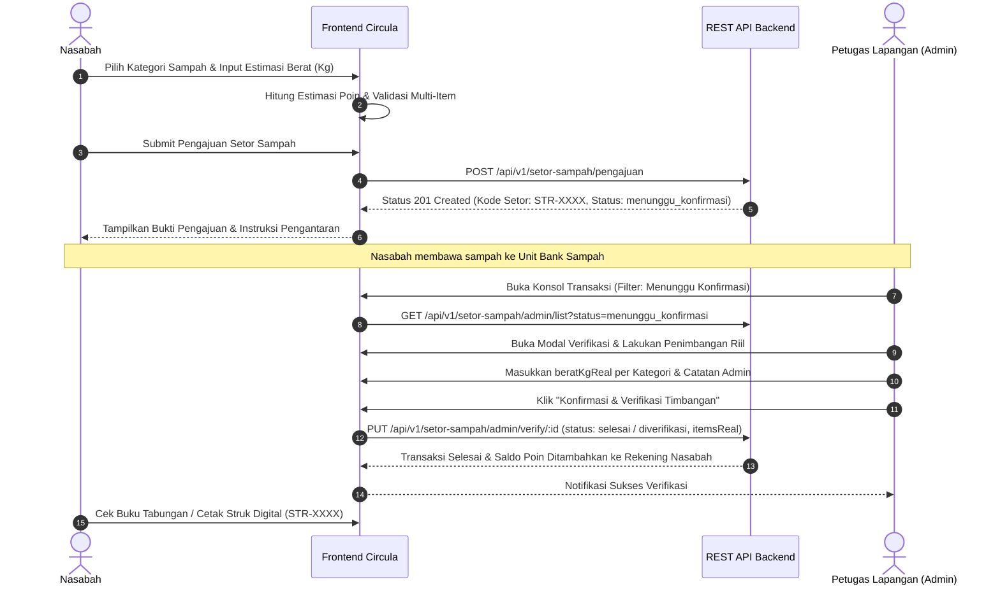
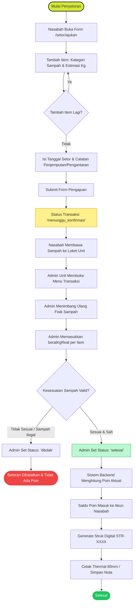
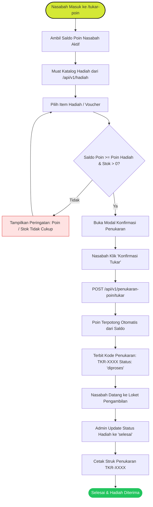
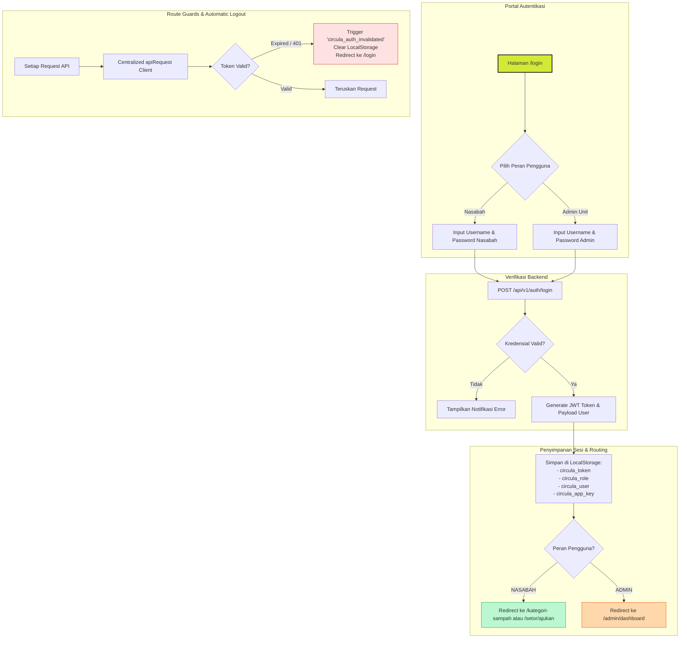
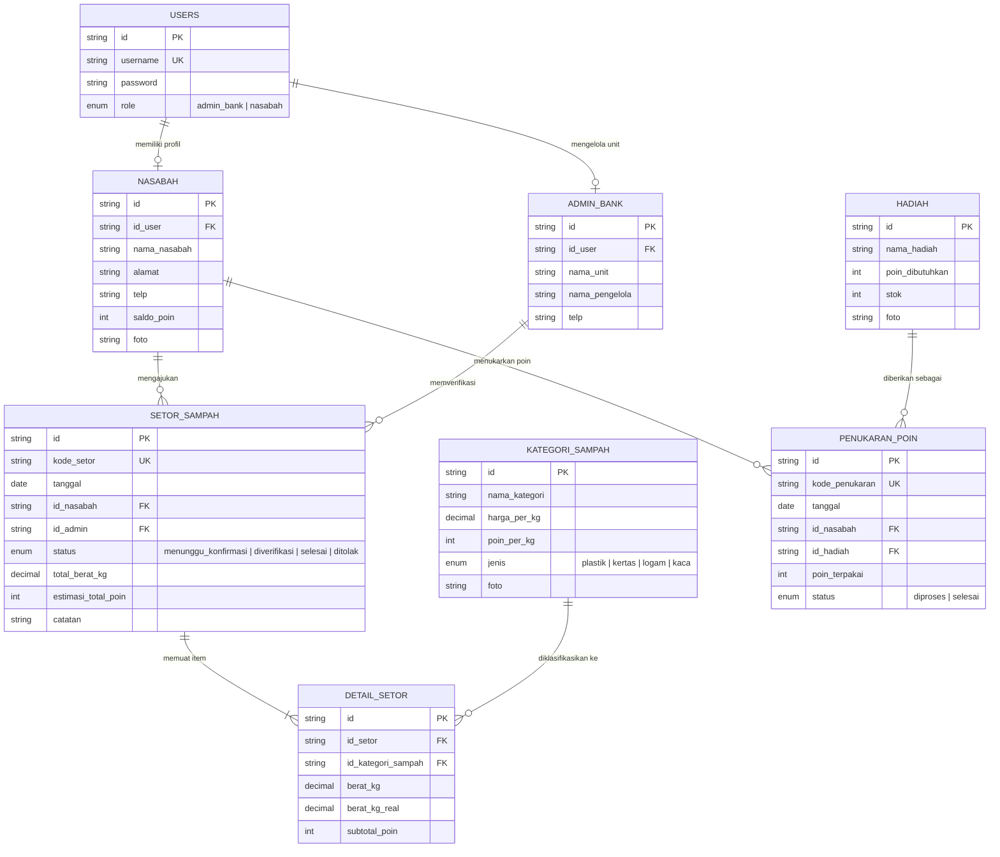

# ♻️ CIRCULA — Digital Bank Sampah & Eco-Reward Platform
### Uji Kompetensi Keahlian (UKK) Rekayasa Perangkat Lunak 2026/2027 — Paket A
**SMK Telkom Malang** | *Eco-Waste Management & Circular Economy System*

---

[](https://nextjs.org/)
[](https://react.dev/)
[](https://www.typescriptlang.org/)
[](https://tailwindcss.com/)
[](https://playwright.dev/)
[](https://nodejs.org/)

---

## 📌 Ringkasan Eksekutif

**CIRCULA** adalah platform pengelolaan bank sampah digital modern berbasis web yang mengadopsi prinsip ekonomi sirkular (*Circular Economy*). Platform ini menjembatani interaksi antara **Nasabah** (siswa, warga sekolah, masyarakat) dan **Pengelola Bank Sampah** (Admin Unit) dalam memproses penyetoran sampah anorganik terpilah, melakukan verifikasi penimbangan riil di lapangan, mengonversinya menjadi saldo poin reward, serta memfasilitasi penukaran poin (*point redemption*) dengan beragam reward fungsional (voucher pulsa, sembako, dan merchandise).

Aplikasi ini dibangun menggunakan arsitektur **Next.js 16 App Router**, **React 19**, **Tailwind CSS v4**, dan **TypeScript**, serta terintegrasi penuh ke backend RESTful API multi-tenant resmi SMK Telkom Malang melalui mekanisme identifikasi `x-app-key` dan `Bearer Token JWT`.

---

## 📑 Daftar Isi

1. [Fitur Unggulan Sistem](#-fitur-unggulan-sistem)
   - [Portal Nasabah](#1-portal-nasabah-siswa--masyarakat)
   - [Portal Pengelola (Admin Unit)](#2-portal-admin-unit-bank-sampah)
2. [Arsitektur Sistem & Alur Data](#-arsitektur-sistem--alur-data)
3. [Alur Bisnis & Flowchart (Mermaid)](#-alur-bisnis--flowchart-sistem)
   - [Flowchart 1: Alur Penyetoran & Verifikasi Sampah](#1-alur-penyetoran--verifikasi-timbangan-lapangan)
   - [Flowchart 2: Alur Penukaran Poin (Redeem Rewards)](#2-alur-penukaran-poin--klaim-hadiah)
   - [Flowchart 3: Autentikasi Multi-Role & Sesi Multi-Tenant](#3-alur-autentikasi-multi-role--manajemen-sesi)
4. [Entity Relationship Diagram (ERD)](#-entity-relationship-diagram-erd)
5. [Struktur Direktori & Modul](#-struktur-direktori--modul)
6. [Panduan Instalasi & Menjalankan Aplikasi](#-panduan-instalasi--menjalankan-aplikasi)
7. [Kredensial Pengujian & Akun Bawaan (Seed Data)](#-kredensial-pengujian--seed-data)
8. [Integrasi REST API & Kontrak Data](#-integrasi-rest-api--kontrak-data)
9. [Automated Testing (Playwright E2E)](#-automated-testing-playwright-e2e)
10. [Desain Sistem, Cetak Thermal & Aksesibilitas](#-desain-sistem-cetak-thermal--aksesibilitas)

---

## ✨ Fitur Unggulan Sistem

### 1. Portal Nasabah (Siswa / Masyarakat)
- **Landing Page Interaktif & Edukatif**:
  - Hero section dinamis dengan badge komputasi dampak lingkungan (*eco-impact metrics*).
  - Kalkulator estimasi poin interaktif berbasis kategori sampah.
  - Alur 4 langkah kerja penyetoran sampah yang mudah dipahami.
- **Autentikasi & Registrasi Mandiri**:
  - Pendaftaran akun nasabah mandiri dengan upload foto profil avatar.
  - Login multi-role otomatis dengan deteksi hak akses token JWT.
- **Katalog Sampah Terpilah**:
  - Menampilkan daftar jenis sampah (Plastik, Kertas, Logam, Kaca).
  - Informasi harga beli per kilogram (Rp/kg) dan nilai reward per kilogram (Poin/kg).
  - Fitur pencarian dan filter kategori sampah secara instan.
- **Form Pengajuan Penyetoran Multi-Item**:
  - Pengajuan setor dengan penambahan baris sampah dinamis (*dynamic multi-row items*).
  - Kalkulasi estimasi berat (Kg) dan estimasi perolehan poin secara *real-time*.
  - Pemilihan tanggal setor dan catatan logistik (opsi antar sendiri atau penjemputan).
- **Buku Tabungan & Histori Setoran**:
  - Monitoring status transaksi: `menunggu_konfirmasi` ⏳, `diverifikasi` ⚖️, `selesai` ✅, `ditolak` ❌.
  - Filter riwayat transaksi berdasarkan kalender bulan (`?bulan=YYYY-MM`).
  - Animasi *Count-Up* pada saldo poin nasabah saat halaman dimuat.
- **Katalog Penukaran Poin (Rewards Marketplace)**:
  - Katalog voucher pulsa, sembako, dan alat tulis.
  - Pengecekan saldo mencukupi dengan tombol aksi cerdas.
  - Modal konfirmasi penukaran poin dengan ringkasan pengurangan saldo.
- **Nota & Bukti Transaksi Digital**:
  - Penerbitan struk transaksi setor (`STR-XXXX`) dan penukaran poin (`TKR-XXXX`).
  - Dilengkapi kode barcode visual, rincian item, dan stempel status transaksi.
  - **Dukungan Cetak Fisik**: Layout responsif dengan CSS `@media print` untuk printer thermal kasir 80mm dan kertas dokumen standar A4.

### 2. Portal Admin Unit Bank Sampah
- **Dashboard Ringkasan & Metrik Analitik**:
  - Kartu KPI: Total Nasabah Aktif, Total Kategori, Total Poin Beredar, dan Akumulasi Tonase Sampah (Kg dan Ton).
  - Tabel transaksi penimbangan terbaru dengan aksi cepat.
- **Verifikasi & Penimbangan Lapangan (Field Weighing Console)**:
  - Pemeriksaan pengajuan setor dari nasabah.
  - Input bobot riil timbangan per item (`beratKgReal`).
  - Perhitungan poin aktual secara otomatis berdasarkan timbangan fisik.
  - Perubahan status transaksi (`menunggu_konfirmasi` ➔ `diverifikasi` / `ditolak` ➔ `selesai`).
  - Input catatan verifikator untuk nasabah.
- **Master CRUD Kategori Sampah**:
  - Tambah, ubah, dan hapus master jenis sampah daur ulang.
  - Pengaturan jenis (ENUM: `plastik`, `kertas`, `logam`, `kaca`), tarif Rp/kg, poin/kg, dan URL foto sampel.
- **Master CRUD Katalog Hadiah / Voucher**:
  - Tambah, edit, dan hapus barang hadiah/voucher.
  - Pengaturan nama hadiah, kuota stok riil, biaya poin, dan gambar produk.
- **Manajemen Nasabah**:
  - Tabel direktori nasabah dengan pencarian nama/alamat.
  - Modal detail nasabah, riwayat setoran, dan penyesuaian data profil.
- **Rekapitulasi & Laporan Bulanan**:
  - Analisis tonase total sampah bulanan (Kg dan Tonase Metrik).
  - Breakdown volume per fraksi material: Plastik, Kertas, Logam, dan Kaca.
  - Estimasi liabilitas kas (pembayaran rupiah) dan sirkulasi poin terbit/terpakai.
  - Mode tampilan siap ekspor dan siap cetak.
- **Profil Unit Bank Sampah**:
  - Pembaruan nama unit pengelola, nama penanggung jawab lapangan, dan kontak operasional.

---

## 🏗 Arsitektur Sistem & Alur Data

Aplikasi CIRCULA dirancang dengan pola **Decoupled Client-Side Architecture** yang modular, *type-safe*, dan terisolasi dari *side-effects*:



---

## 🔄 Alur Bisnis & Flowchart Sistem

### 1. Alur Penyetoran & Verifikasi Timbangan Lapangan

Alur berikut menggambarkan siklus hidup penyetoran sampah mulai dari pengajuan mandiri oleh Nasabah hingga penimbangan fisik dan penerbitan saldo poin oleh Admin Bank:





---

### 2. Alur Penukaran Poin & Klaim Hadiah

Alur penukaran akumulasi poin nasabah dengan reward barang/voucher fisik:



---

### 3. Alur Autentikasi Multi-Role & Manajemen Sesi

Aplikasi mengimplementasikan pemisahan hak akses berbasis peran (*Role-Based Access Control*) antara **Nasabah** dan **Admin Unit Bank**:



---

## 🗄 Entity Relationship Diagram (ERD)

Struktur relasi basis data yang menopang seluruh operasi transaksi dan entitas sistem CIRCULA:



---

## 📁 Struktur Direktori & Modul

```text
circula-frontend/
├── .env.local                     # Environment variables (Base URL & App Key)
├── package.json                   # Project dependencies & scripts
├── playwright.config.ts           # Konfigurasi automated testing Playwright
├── tsconfig.json                  # Strict TypeScript configuration
├── e2e/                           # End-to-End Test Suite
│   ├── auth.spec.ts               # Pengujian alur login, registrasi & sesi
│   ├── setor-sampah.spec.ts       # Pengujian form setor & status tracking
│   ├── penukaran-poin.spec.ts     # Pengujian katalog reward & klaim poin
│   ├── admin-crud.spec.ts         # Pengujian master kategori & hadiah
│   ├── admin-transaksi-laporan.spec.ts # Pengujian verifikasi timbangan & rekap
│   └── non-functional.spec.ts     # Pengujian responsiveness & UI rendering
├── src/
│   ├── app/                       # Next.js 16 App Router Pages
│   │   ├── layout.tsx             # Root layout dengan Font Plus Jakarta Sans
│   │   ├── globals.css            # Tailwind CSS v4 theme, tokens & keyframes
│   │   ├── page.tsx               # High-converting Landing Page
│   │   ├── login/                 # Multi-role Login page
│   │   ├── register/              # Nasabah self-registration page
│   │   ├── kategori-sampah/       # Katalog sampah publik & nasabah
│   │   ├── setor/                 # Form pengajuan setor multi-item
│   │   ├── histori/               # Buku tabungan & histori bulanan
│   │   ├── tukar-poin/            # Marketplace reward & redeem poin
│   │   ├── nota/                  # Official digital receipt ([id] & thermal print)
│   │   └── admin/                 # Portal Khusus Admin Unit Bank
│   │       ├── dashboard/         # Metrik analitik & ringkasan operasional
│   │       ├── transaksi/         # Konsol verifikasi timbangan lapangan
│   │       ├── nasabah/           # Manajemen direktori nasabah
│   │       ├── kategori-sampah/   # Master CRUD jenis sampah
│   │       ├── hadiah/            # Master CRUD reward & voucher
│   │       ├── laporan/           # Rekapitulasi tonase & keuangan bulanan
│   │       ├── profil/            # Identitas unit bank & kontak pengelola
│   │       ├── login/             # Login pintas portal unit admin
│   │       └── register/          # Pendaftaran unit bank sampah baru
│   ├── components/                # Modular React Components
│   │   ├── admin-dashboard/       # Widget analitik, stat cards, & table
│   │   ├── admin-transaksi/       # Modal verifikasi timbangan & filter status
│   │   ├── admin-kategori/        # Form modal CRUD kategori sampah
│   │   ├── admin-hadiah/          # Form modal CRUD hadiah & stok
│   │   ├── admin-nasabah/         # Tabel data nasabah & modal detail
│   │   ├── admin-laporan/         # Kartu tonase breakdown & export views
│   │   ├── admin-profil/          # Form profil unit pengelola
│   │   ├── landing/               # Hero, Mission, Workflow, Pre-footer CTA
│   │   ├── layout/                # Navbar (role-aware), Footer, Mobile Drawer
│   │   ├── login/                 # RoleSegmentSwitcher, LoginForm
│   │   ├── register/              # RegisterForm, PhotoUpload, ShowcaseHero
│   │   ├── setor/                 # MultiItemForm, RealtimeCalculator
│   │   ├── histori/               # StatusStageGuide, HistoryTable, MonthFilter
│   │   ├── tukar-poin/            # RewardGrid, RedeemModal, PointBadge
│   │   ├── nota/                  # DigitalReceiptSheet (Thermal 80mm & A4)
│   │   └── ui/                    # Atomic UI (Badge, ShimmerSkeleton, Button)
│   ├── hooks/                     # Custom Domain Hooks
│   │   ├── useAjukanSetor.ts      # State management pengajuan setor multi-item
│   │   ├── useAdminTransaksi.ts   # State verifikasi timbangan lapangan
│   │   ├── useAdminKategori.ts    # Handler CRUD kategori sampah
│   │   ├── useAdminHadiah.ts      # Handler CRUD master hadiah
│   │   ├── useAdminNasabah.ts     # Handler manajemen nasabah
│   │   ├── useAdminLaporan.ts     # Handler filter & agregasi rekapitulasi
│   │   ├── useTukarPoin.ts        # Handler saldo & transaksi redeem
│   │   ├── useHistoriSetor.ts     # Handler buku tabungan nasabah
│   │   ├── useLoginMultiRole.ts   # Handler autentikasi dual-role
│   │   └── useCountUp.ts          # Animasi easing angka poin
│   ├── services/                  # Business Logic & API Calling
│   │   ├── authService.ts         # Session login, register nasabah & token
│   │   ├── adminAuthService.ts    # Register unit & admin session
│   │   ├── setorSampahService.ts  # Pengajuan setor nasabah
│   │   ├── adminTransaksiService.ts # Verifikasi timbangan & status setor
│   │   ├── kategoriSampahService.ts # Fetch katalog sampah publik
│   │   ├── adminKategoriService.ts  # CRUD master kategori sampah
│   │   ├── tukarPoinService.ts    # Redeem hadiah & saldo nasabah
│   │   ├── adminHadiahService.ts  # CRUD master hadiah & voucher
│   │   ├── adminNasabahService.ts # CRUD direktori nasabah
│   │   ├── adminLaporanService.ts # Agregasi laporan bulanan
│   │   └── notaService.ts         # Pengambilan detail struk setor & tukar
│   ├── lib/
│   │   └── api/
│   │       ├── client.ts          # Centralized apiRequest<T>, auth header injection
│   │       └── endpoints.ts       # Registry 37 endpoint tanpa hardcode string
│   └── types/                     # TypeScript Interface & Type Definitions
│       ├── auth.ts                # User session, login payload & credentials
│       ├── setorSampah.ts         # Item setor, pengajuan DTO, status enum
│       ├── kategoriSampah.ts      # Kategori sampah entity & filter
│       ├── tukarPoin.ts           # Hadiah entity, claim payload, nota tukar
│       ├── nota.ts                # Format terpadu struk STR & TKR
│       ├── adminTransaksi.ts      # Verifikasi timbangan & riwayat admin
│       ├── adminLaporan.ts        # Rekap tonase & metrik keuangan
│       └── adminNasabah.ts        # Nasabah profile entity
```

---

## 🚀 Panduan Instalasi & Menjalankan Aplikasi

### Prasyarat Sistem
- **Node.js**: Versi `20.x` atau lebih baru
- **Package Manager**: `npm` (v10+), `pnpm`, atau `yarn`
- **Git**

### Langkah 1: Kloning Repositori
```bash
git clone https://github.com/nabilkencana/circula-frontend.git
cd circula-frontend
```

### Langkah 2: Instalasi Dependensi
```bash
npm install
```

### Langkah 3: Konfigurasi Environment Variables
Buat berkas `.env.local` pada direktori *root* proyek (salin atau gunakan format berikut):

```env
# URL Backend Server Resmi UKK SMK Telkom Malang
NEXT_PUBLIC_API_BASE_URL=https://learn.smktelkom-mlg.sch.id/bank_sampah

# App Key Multi-Tenant (Diberikan saat pendaftaran App Maker)
NEXT_PUBLIC_DEFAULT_APP_KEY=1d99c078-9a3f-45e0-978e-8e0806338593
```

> [!NOTE]
> Sistem secara otomatis menyertakan header `x-app-key` pada setiap panggilan API ke server backend. Jika `NEXT_PUBLIC_DEFAULT_APP_KEY` diganti, seluruh panggilan API akan langsung menyesuaikan ke tenant siswa yang bersangkutan.

### Langkah 4: Menjalankan Server Pengembangan
```bash
npm run dev
```
Buka peramban dan navigasikan ke: [http://localhost:3000](http://localhost:3000)

### Langkah 5: Membangun Versi Produksi (Production Build)
```bash
npm run build
npm run start
```

---

## 🔑 Kredensial Pengujian & Seed Data

Backend menyediakan endpoint inisialisasi cepat (`POST /api/v1/seed`) yang telah menyertakan data pengujian standar:

| Peran | Username | Password | Hak Akses Utama |
|---|---|---|---|
| **Admin Bank** | `admin_banksampah` | `admin123` | Dashboard Admin, Verifikasi Timbangan, Master Kategori, Master Hadiah, Manajemen Nasabah, Rekap Laporan Bulanan. |
| **Nasabah 1** | `nasabah_budi` | `password123` | Pengajuan Setor Sampah, Tabungan Poin, Tukar Hadiah, Cetak Struk Digital. |
| **Nasabah 2** | `nasabah_siti` | `password123` | Pengajuan Setor Sampah, Tabungan Poin, Tukar Hadiah, Cetak Struk Digital. |

---

## 🌐 Integrasi REST API & Kontrak Data

Aplikasi berkomunikasi dengan backend server melalui 37 endpoint terstandarisasi. Seluruh panggilan dibungkus dalam *envelope* respons seragam:

```json
{
  "statusCode": 200,
  "success": true,
  "message": "Operasi berhasil",
  "data": { ... },
  "timestamp": "2026-09-18T00:00:00.000Z"
}
```

### Ringkasan Tabel Endpoint

| Modul | Method | Endpoint Path | Deskripsi | Hak Akses |
|---|---|---|---|---|
| **Auth** | `POST` | `/api/v1/auth/login` | Login user multi-role | Publik |
| **Auth** | `POST` | `/api/v1/auth/nasabah/register` | Pendaftaran akun nasabah | Publik |
| **Auth** | `POST` | `/api/v1/auth/admin/register` | Registrasi unit bank baru | Publik |
| **Auth** | `GET` | `/api/v1/auth/me` | Cek identitas & peran sesi | Bearer |
| **Kategori** | `GET` | `/api/v1/kategori-sampah` | Daftar harga & reward sampah | Publik / Bearer |
| **Kategori** | `POST` | `/api/v1/kategori-sampah` | Tambah master kategori | Admin |
| **Kategori** | `PUT` | `/api/v1/kategori-sampah/:id` | Update data kategori | Admin |
| **Kategori** | `DELETE` | `/api/v1/kategori-sampah/:id` | Hapus data kategori | Admin |
| **Setor** | `POST` | `/api/v1/setor-sampah/pengajuan` | Pengajuan setor multi-item | Nasabah |
| **Setor** | `GET` | `/api/v1/setor-sampah/my-setor` | Riwayat setoran pribadi | Nasabah |
| **Setor** | `GET` | `/api/v1/setor-sampah/:id` | Detail transaksi / Nota setor | Nasabah / Admin |
| **Setor** | `GET` | `/api/v1/setor-sampah/admin/list`| Daftar pengajuan setor | Admin |
| **Setor** | `PUT` | `/api/v1/setor-sampah/admin/verify/:id` | Verifikasi timbangan fisik | Admin |
| **Hadiah** | `GET` | `/api/v1/hadiah` | Katalog reward & stok | Publik / Bearer |
| **Hadiah** | `POST` | `/api/v1/hadiah` | Tambah hadiah baru | Admin |
| **Hadiah** | `PUT` | `/api/v1/hadiah/:id` | Ubah data hadiah | Admin |
| **Hadiah** | `DELETE` | `/api/v1/hadiah/:id` | Hapus data hadiah | Admin |
| **Tukar** | `POST` | `/api/v1/penukaran-poin/tukar` | Klaim reward dengan saldo poin | Nasabah |
| **Tukar** | `GET` | `/api/v1/penukaran-poin/my-penukaran` | Riwayat penukaran pribadi | Nasabah |
| **Tukar** | `GET` | `/api/v1/penukaran-poin/admin/list` | Seluruh transaksi penukaran | Admin |
| **Tukar** | `PUT` | `/api/v1/penukaran-poin/admin/status/:id` | Update status hadiah | Admin |
| **Tukar** | `GET` | `/api/v1/penukaran-poin/nota/:id` | Struk penukaran poin | Nasabah / Admin |
| **Nasabah** | `GET` | `/api/v1/admin/nasabah` | Direktori seluruh nasabah | Admin |
| **Nasabah** | `GET` | `/api/v1/admin/nasabah/:id` | Detail profil nasabah | Admin |
| **Laporan** | `GET` | `/api/v1/rekapitulasi/bulanan` | Rekapitulasi tonase bulanan | Admin |
| **Dashboard**| `GET` | `/api/v1/dashboard/summary` | Ringkasan saldo & setor nasabah | Nasabah |
| **Dashboard**| `GET` | `/api/v1/dashboard/stats` | KPI analitik total bank | Admin |
| **Utility** | `POST` | `/api/v1/seed` | Reset & generate data contoh | Tenant Key |

---

## 🧪 Automated Testing (Playwright E2E)

Aplikasi dilengkapi *test suite* komprehensif menggunakan **Playwright** untuk memastikan stabilitas transaksi penting:

```bash
# Menjalankan seluruh pengujian end-to-end
npm run test:e2e

# Menjalankan pengujian dengan visual UI mode
npx playwright test --ui

# Menjalankan pengujian spesifik untuk modul penyetoran
npx playwright test e2e/setor-sampah.spec.ts
```

### Cakupan Pengujian (Test Coverage)
1. **`auth.spec.ts`**: Registrasi nasabah baru, pengalihan peran (role switcher), validasi kredensial salah, dan logout.
2. **`setor-sampah.spec.ts`**: Penambahan baris sampah dinamis, kalkulasi poin instan, pengajuan transaksi, dan verifikasi status `menunggu_konfirmasi`.
3. **`penukaran-poin.spec.ts`**: Validasi saldo poin mencukupi, pemilihan hadiah, pembuatan transaksi penukaran `TKR-XXXX`, dan nota receipt.
4. **`admin-crud.spec.ts`**: Operasi CRUD master kategori sampah dan master katalog reward.
5. **`admin-transaksi-laporan.spec.ts`**: Input timbangan lapangan (`beratKgReal`), transisi status ke `selesai`, dan verifikasi angka rekapitulasi tonase bulanan.
6. **`non-functional.spec.ts`**: Validasi responsivitas tata letak (Desktop, Tablet, Mobile) dan integritas cetak `@media print`.

---

## 🎨 Desain Sistem, Cetak Thermal & Aksesibilitas

### 1. Palet Warna Desain (Design Tokens)
CIRCULA mengadopsi tema kontemporer *Eco-Tech* yang memadukan aksen cerah fungsional dengan kontras tinggi:

| Token | Nilai Hex | Penggunaan Utama |
|---|---|---|
| `--color-brand-neon` | `#D4E836` | Aksen tombol utama, status sukses, poin highlight, dan brand icon |
| `--color-brand-neon-hover` | `#BFD42B` | Efek interaksi kursor hover pada tombol brand |
| `--color-dark-container` | `#0D110C` | Kartu kontras tinggi, navbar badge, dan latar belakang header |
| `--color-dark-widget` | `#1F2819` | Widget info dampak lingkungan dan aksen sekunder |
| `--color-surface-card` | `#FFFFFF` | Latar belakang modul kartu dan dialog modal |
| `--color-inset-gray` | `#F8F9F8` | Kontainer masukan formulir dan latar belakang tabel |
| `--color-text-primary` | `#0F120E` | Tipografi utama dengan keterbacaan tajam |
| `--color-text-secondary`| `#6B7268` | Keterangan pembantu dan label metadata |

### 2. Optimasi Cetak Struk (Thermal 80mm & A4)
Pada berkas `src/app/globals.css`, telah diintegrasikan *styling* cetak khusus:
- Menghilangkan navigasi, header, dan footer saat dialog cetak terbuka.
- Mencegah pemotongan baris di tengah tabel item (*page-break-inside: avoid*).
- Menyesuaikan lebar struk secara otomatis pada printer POS thermal kasir standar 80mm maupun kertas laporan A4.

---

## 👥 Pengembang & Hak Cipta

- **Aplikasi**: CIRCULA — Digital Bank Sampah & Eco-Reward Platform
- **Program Keahlian**: Rekayasa Perangkat Lunak (RPL)
- **Institusi**: SMK Telkom Malang
- **Uji Kompetensi Keahlian (UKK)**: Tahun Pelajaran 2026/2027 — Paket A

*CIRCULA — Ubah Sampah Jadi Berkah, Bangun Masa Depan Lestari.*
